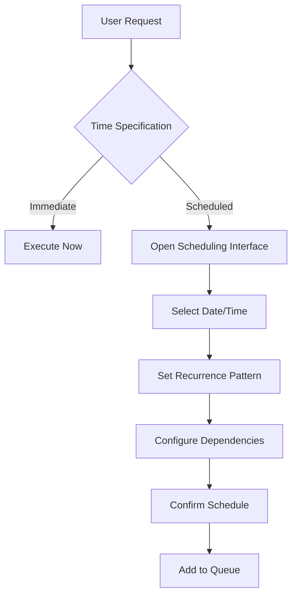
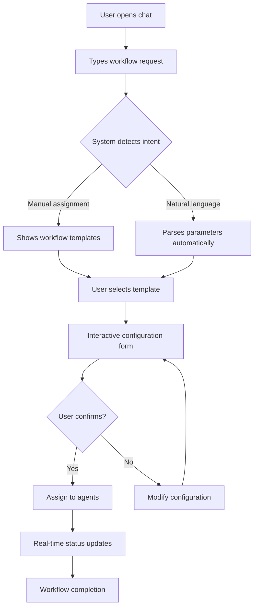
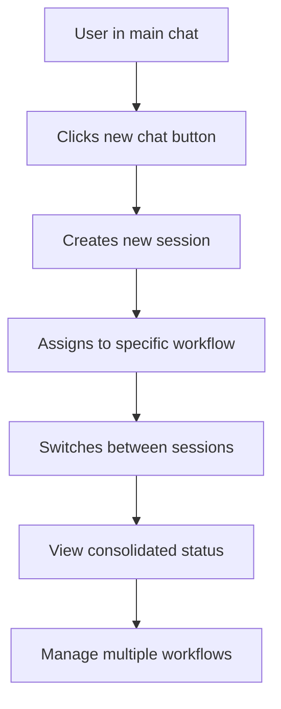

# Enhanced Chat Interface Design Specifications
## El Jefe Monitoring Dashboard - Workflow Management Chat

---

## Executive Summary

This document outlines the UI/UX design specifications for an enhanced chat interface that integrates powerful workflow assignment and scheduling capabilities into the existing El Jefe monitoring dashboard. The design maintains visual consistency with the current dashboard while adding sophisticated workflow management features through an intuitive chat-centric interface.

---

## Current System Analysis

### Existing Design System
- **Color Palette**: Purple gradient theme (`#667eea` to `#764ba2`)
- **Typography**: System fonts (-apple-system, BlinkMacSystemFont, Segoe UI)
- **Layout**: Card-based design with glassmorphism effects
- **Visual Elements**: Rounded corners (15px), backdrop blur, subtle shadows
- **Responsive**: Mobile-first approach with grid layouts

### Current Chat Implementation
- Basic WebSocket communication with El Jefe
- Simple text message exchange
- System status notifications
- Limited message history
- No workflow management capabilities

---

## Design Philosophy & Principles

### Core Principles
1. **Chat-First Workflow Management** - Natural language interaction as the primary interface
2. **Progressive Disclosure** - Advanced features revealed when needed
3. **Contextual Intelligence** - AI-powered suggestions and automation
4. **Visual Hierarchy** - Clear information organization with workflow prominence
5. **Accessibility First** - WCAG 2.1 AA compliance throughout

### User Experience Goals
- **Seamless Workflow Control**: Assign and manage workflows through natural conversation
- **Intelligent Assistance**: AI-powered suggestions reduce cognitive load
- **Real-time Visibility**: Live status updates integrated into chat flow
- **Multi-session Management**: Handle multiple concurrent workflows efficiently
- **Mobile Excellence**: Full functionality on all device sizes

---

## Enhanced Chat Interface Architecture

### 1. Main Chat Container

#### Layout Structure
```
┌─────────────────────────────────────────────────────────────┐
│ Chat Header (Agent Status, Quick Actions, Settings)        │
├─────────────────────────────────────────────────────────────┤
│ Workflow Assignment Panel (Collapsible)                     │
├─────────────────────────────────────────────────────────────┤
│ Message Timeline                                            │
│ ┌─────────────────────────────────────────────────────────┐ │
│ │ Workflow Status Card                                    │ │
│ │ User Message                                           │ │
│ │ Agent Response (with interactive elements)             │ │
│ │ System Notification                                    │ │
│ │ File Upload                                            │ │
│ │ Code Block                                             │ │
│ └─────────────────────────────────────────────────────────┘ │
├─────────────────────────────────────────────────────────────┤
│ Smart Input Area (Suggestions, Attachments, Commands)      │
└─────────────────────────────────────────────────────────────┘
```

#### Responsive Behavior
- **Desktop**: 3-column layout (sidebar, chat, workflow panel)
- **Tablet**: 2-column layout (chat + collapsible panels)
- **Mobile**: Single column with slide-out panels

### 2. Component Specifications

#### Chat Header Component
```css
.chat-header {
  background: rgba(255, 255, 255, 0.98);
  backdrop-filter: blur(20px);
  padding: 16px 24px;
  border-bottom: 1px solid rgba(255, 255, 255, 0.2);
  display: flex;
  justify-content: space-between;
  align-items: center;
  min-height: 72px;
}

.agent-status-indicator {
  display: flex;
  align-items: center;
  gap: 12px;
  padding: 8px 16px;
  background: rgba(102, 126, 234, 0.1);
  border-radius: 24px;
  font-weight: 600;
}

.quick-actions {
  display: flex;
  gap: 8px;
}

.action-button {
  padding: 8px 16px;
  border-radius: 20px;
  border: none;
  font-weight: 600;
  font-size: 14px;
  cursor: pointer;
  transition: all 0.3s ease;
}
```

#### Enhanced Message Types
1. **Text Messages**: Standard chat bubbles with markdown support
2. **Workflow Assignment Cards**: Interactive workflow setup interfaces
3. **Status Update Messages**: Real-time progress indicators
4. **File Share Messages**: Drag-and-drop file handling
5. **Code Block Messages**: Syntax-highlighted code with copy functionality
6. **Interactive Elements**: Buttons, forms, and controls within messages
7. **Agent Coordination Messages**: Multi-agent handoff notifications

#### Workflow Assignment Panel
```css
.workflow-assignment-panel {
  background: rgba(248, 249, 250, 0.95);
  border-radius: 12px;
  padding: 20px;
  margin: 16px 0;
  border: 2px dashed #dee2e6;
  transition: all 0.3s ease;
}

.workflow-assignment-panel.active {
  border-color: #667eea;
  background: rgba(102, 126, 234, 0.05);
}

.template-grid {
  display: grid;
  grid-template-columns: repeat(auto-fit, minmax(200px, 1fr));
  gap: 12px;
  margin: 16px 0;
}

.workflow-template {
  padding: 16px;
  background: white;
  border-radius: 8px;
  border: 2px solid transparent;
  cursor: pointer;
  transition: all 0.3s ease;
  text-align: center;
}

.workflow-template:hover {
  border-color: #667eea;
  transform: translateY(-2px);
  box-shadow: 0 8px 25px rgba(102, 126, 234, 0.15);
}
```

---

## Workflow Management Features

### 1. Workflow Assignment System

#### Natural Language Processing
- **Intent Recognition**: Automatically detect workflow assignment requests
- **Entity Extraction**: Parse parameters from natural language
- **Template Matching**: Suggest relevant workflow templates
- **Smart Defaults**: Pre-fill common parameters based on context

#### Assignment Flow
1. **Detection**: User types "Create a new workflow for..."
2. **Suggestion**: AI suggests relevant templates
3. **Configuration**: Interactive form within chat message
4. **Confirmation**: Preview before execution
5. **Assignment**: Route to appropriate agents

#### Workflow Templates
```javascript
const workflowTemplates = {
  'research-analysis': {
    name: 'Research & Analysis',
    icon: '🔍',
    description: 'Comprehensive research and data analysis',
    parameters: ['topic', 'scope', 'timeline', 'sources'],
    defaultAgents: ['researcher', 'analyst'],
    estimatedTime: '2-4 hours'
  },
  'content-creation': {
    name: 'Content Creation',
    icon: '✍️',
    description: 'Generate articles, scripts, or documentation',
    parameters: ['content_type', 'topic', 'tone', 'length'],
    defaultAgents: ['researcher', 'writer'],
    estimatedTime: '1-3 hours'
  },
  'code-development': {
    name: 'Code Development',
    icon: '💻',
    description: 'Build and deploy software solutions',
    parameters: ['requirements', 'language', 'framework', 'timeline'],
    defaultAgents: ['coder', 'analyst'],
    estimatedTime: '4-8 hours'
  },
  'security-audit': {
    name: 'Security Audit',
    icon: '🔒',
    description: 'Comprehensive security assessment',
    parameters: ['target', 'scope', 'compliance', 'timeline'],
    defaultAgents: ['security-reviewer', 'analyst'],
    estimatedTime: '6-12 hours'
  }
};
```

### 2. Workflow Scheduling System

#### Scheduling Interface
- **Calendar Integration**: Visual date/time selection
- **Recurring Workflows**: Support for periodic tasks
- **Dependency Management**: Set workflow prerequisites
- **Resource Allocation**: Balance agent workloads
- **Priority Levels**: Urgent, High, Normal, Low priority

#### Scheduling Flow


#### Scheduling Component
```css
.scheduling-interface {
  background: white;
  border-radius: 12px;
  padding: 24px;
  box-shadow: 0 4px 20px rgba(0, 0, 0, 0.1);
  margin: 16px 0;
}

.datetime-selector {
  display: grid;
  grid-template-columns: 1fr 1fr;
  gap: 16px;
  margin: 16px 0;
}

.recurrence-options {
  display: flex;
  flex-wrap: wrap;
  gap: 8px;
  margin: 12px 0;
}

.recurrence-button {
  padding: 8px 16px;
  border: 2px solid #e9ecef;
  border-radius: 20px;
  background: white;
  cursor: pointer;
  transition: all 0.3s ease;
}

.recurrence-button.selected {
  border-color: #667eea;
  background: rgba(102, 126, 234, 0.1);
}
```

---

## Enhanced Chat Features

### 1. Rich Message Content

#### Interactive Elements
- **Action Buttons**: Direct workflow controls within messages
- **Progress Indicators**: Real-time status bars and animations
- **Data Visualizations**: Charts and graphs embedded in chat
- **Forms**: Input forms for parameter collection
- **Toggles**: Settings and preferences controls

#### File Handling
```css
.file-upload-area {
  border: 2px dashed #dee2e6;
  border-radius: 12px;
  padding: 32px;
  text-align: center;
  margin: 16px 0;
  transition: all 0.3s ease;
  cursor: pointer;
}

.file-upload-area:hover {
  border-color: #667eea;
  background: rgba(102, 126, 234, 0.05);
}

.file-upload-area.dragover {
  border-color: #27ae60;
  background: rgba(39, 174, 96, 0.1);
}

.attached-file {
  display: flex;
  align-items: center;
  gap: 12px;
  padding: 12px;
  background: #f8f9fa;
  border-radius: 8px;
  margin: 8px 0;
}
```

### 2. Smart Input System

#### Enhanced Input Area
```css
.enhanced-input-container {
  display: flex;
  flex-direction: column;
  gap: 12px;
  padding: 16px;
  background: rgba(255, 255, 255, 0.98);
  border-top: 1px solid rgba(255, 255, 255, 0.2);
}

.input-row {
  display: flex;
  gap: 12px;
  align-items: flex-end;
}

.message-input {
  flex: 1;
  min-height: 48px;
  max-height: 200px;
  padding: 12px 16px;
  border: 2px solid #e9ecef;
  border-radius: 24px;
  font-size: 15px;
  line-height: 1.5;
  resize: none;
  outline: none;
  transition: all 0.3s ease;
}

.message-input:focus {
  border-color: #667eea;
  box-shadow: 0 0 0 4px rgba(102, 126, 234, 0.1);
}

.input-actions {
  display: flex;
  gap: 8px;
}

.action-icon {
  width: 40px;
  height: 40px;
  border-radius: 50%;
  border: none;
  background: #f8f9fa;
  cursor: pointer;
  display: flex;
  align-items: center;
  justify-content: center;
  transition: all 0.3s ease;
}

.action-icon:hover {
  background: #e9ecef;
  transform: scale(1.05);
}
```

#### Smart Suggestions
- **Command Suggestions**: Auto-complete for workflow commands
- **Template Recommendations**: Context-aware template suggestions
- **Parameter Hints**: Helpful parameter input assistance
- **Quick Actions**: Frequently used workflow shortcuts

### 3. Multi-Chat Support

#### Chat Session Management
```css
.chat-sessions-sidebar {
  width: 280px;
  background: rgba(255, 255, 255, 0.95);
  border-right: 1px solid rgba(255, 255, 255, 0.2);
  padding: 16px 0;
  overflow-y: auto;
}

.session-item {
  padding: 12px 16px;
  cursor: pointer;
  transition: all 0.3s ease;
  border-left: 3px solid transparent;
}

.session-item:hover {
  background: rgba(102, 126, 234, 0.05);
}

.session-item.active {
  background: rgba(102, 126, 234, 0.1);
  border-left-color: #667eea;
}

.session-meta {
  display: flex;
  justify-content: space-between;
  align-items: center;
  margin-top: 4px;
  font-size: 12px;
  color: #6c757d;
}
```

---

## Agent Coordination Features

### 1. Agent Status Visualization

#### Agent Coordination Panel
```css
.agent-coordination-panel {
  background: rgba(248, 249, 250, 0.95);
  border-radius: 12px;
  padding: 20px;
  margin: 16px 0;
}

.agent-grid {
  display: grid;
  grid-template-columns: repeat(auto-fit, minmax(200px, 1fr));
  gap: 16px;
  margin-top: 16px;
}

.agent-card {
  background: white;
  border-radius: 8px;
  padding: 16px;
  border-left: 4px solid #667eea;
  transition: all 0.3s ease;
}

.agent-card.busy {
  border-left-color: #f39c12;
}

.agent-card.available {
  border-left-color: #27ae60;
}

.agent-workload {
  margin-top: 12px;
  font-size: 12px;
  color: #6c757d;
}

.workload-bar {
  height: 4px;
  background: #e9ecef;
  border-radius: 2px;
  margin-top: 4px;
  overflow: hidden;
}

.workload-fill {
  height: 100%;
  background: linear-gradient(90deg, #667eea, #764ba2);
  transition: width 0.3s ease;
}
```

### 2. Workflow Handoff Visualization

#### Handoff Flow Indicator
```css
.workflow-handoff {
  display: flex;
  align-items: center;
  gap: 16px;
  padding: 16px;
  background: rgba(102, 126, 234, 0.05);
  border-radius: 12px;
  margin: 16px 0;
}

.handoff-agent {
  flex: 1;
  text-align: center;
  padding: 12px;
  background: white;
  border-radius: 8px;
  position: relative;
}

.handoff-agent.completed {
  background: rgba(39, 174, 96, 0.1);
  border: 2px solid #27ae60;
}

.handoff-agent.active {
  background: rgba(102, 126, 234, 0.1);
  border: 2px solid #667eea;
}

.handoff-agent.pending {
  background: #f8f9fa;
  border: 2px solid #dee2e6;
}

.handoff-arrow {
  width: 32px;
  height: 32px;
  display: flex;
  align-items: center;
  justify-content: center;
  color: #6c757d;
}
```

---

## Accessibility Features

### 1. WCAG 2.1 AA Compliance

#### Keyboard Navigation
```css
.focusable:focus {
  outline: 2px solid #667eea;
  outline-offset: 2px;
  border-radius: 4px;
}

.skip-link {
  position: absolute;
  top: -40px;
  left: 6px;
  background: #667eea;
  color: white;
  padding: 8px;
  text-decoration: none;
  border-radius: 4px;
  z-index: 1000;
}

.skip-link:focus {
  top: 6px;
}
```

#### Screen Reader Support
- **ARIA Labels**: Comprehensive labeling for all interactive elements
- **Live Regions**: Dynamic content updates announced properly
- **Semantic HTML**: Proper heading structure and landmark elements
- **Alternative Text**: Descriptive alt text for all visual content

### 2. Visual Accessibility

#### High Contrast Mode
```css
@media (prefers-contrast: high) {
  .chat-message {
    border-width: 2px;
  }

  .action-button {
    border: 2px solid currentColor;
  }
}

@media (prefers-reduced-motion: reduce) {
  * {
    animation-duration: 0.01ms !important;
    animation-iteration-count: 1 !important;
    transition-duration: 0.01ms !important;
  }
}
```

---

## Mobile Responsive Design

### 1. Breakpoint Strategy
- **Small Mobile**: 320px - 479px
- **Mobile**: 480px - 767px
- **Tablet**: 768px - 1023px
- **Desktop**: 1024px - 1439px
- **Large Desktop**: 1440px+

### 2. Mobile Layout Adaptations

#### Mobile Chat Interface
```css
@media (max-width: 767px) {
  .chat-container {
    height: 100vh;
    display: flex;
    flex-direction: column;
  }

  .chat-header {
    padding: 12px 16px;
    min-height: 60px;
  }

  .chat-messages {
    flex: 1;
    padding: 16px;
    overflow-y: auto;
  }

  .enhanced-input-container {
    padding: 12px 16px;
  }

  .sidebar-panel {
    position: fixed;
    top: 0;
    left: -100%;
    width: 80%;
    height: 100%;
    background: white;
    z-index: 1000;
    transition: left 0.3s ease;
  }

  .sidebar-panel.open {
    left: 0;
  }
}
```

#### Touch-Friendly Interactions
```css
.touch-target {
  min-height: 44px;
  min-width: 44px;
  padding: 12px;
}

.swipe-gesture {
  touch-action: pan-x;
  overflow-x: hidden;
}

@media (hover: none) and (pointer: coarse) {
  .action-button:hover {
    transform: none;
  }

  .action-button:active {
    transform: scale(0.95);
  }
}
```

---

## Performance Considerations

### 1. Message Virtualization
- **Virtual Scrolling**: Handle large chat histories efficiently
- **Message Throttling**: Batch updates for smooth performance
- **Lazy Loading**: Load message content on demand
- **Memory Management**: Optimize DOM node usage

### 2. Real-time Updates
- **WebSocket Optimization**: Efficient message batching
- **Debounced Rendering**: Smooth UI updates
- **Progressive Enhancement**: Graceful degradation on slow connections

---

## User Flow Documentation

### 1. Workflow Assignment Flow



### 2. Multi-Chat Management Flow



---

## Implementation Guidelines

### 1. CSS Custom Properties (Design Tokens)

```css
:root {
  /* Color Palette */
  --primary-gradient: linear-gradient(45deg, #667eea, #764ba2);
  --primary-color: #667eea;
  --primary-hover: #5a6fd8;
  --secondary-color: #764ba2;
  --success-color: #27ae60;
  --warning-color: #f39c12;
  --error-color: #e74c3c;

  /* Spacing System */
  --spacing-xs: 4px;
  --spacing-sm: 8px;
  --spacing-md: 16px;
  --spacing-lg: 24px;
  --spacing-xl: 32px;
  --spacing-xxl: 48px;

  /* Typography */
  --font-family-base: -apple-system, BlinkMacSystemFont, 'Segoe UI', Roboto, sans-serif;
  --font-family-mono: 'SF Mono', Monaco, 'Cascadia Code', 'Roboto Mono', Consolas, monospace;
  --font-size-xs: 12px;
  --font-size-sm: 14px;
  --font-size-base: 15px;
  --font-size-lg: 18px;
  --font-size-xl: 24px;

  /* Border Radius */
  --border-radius-sm: 6px;
  --border-radius-md: 8px;
  --border-radius-lg: 12px;
  --border-radius-xl: 16px;
  --border-radius-full: 50%;

  /* Shadows */
  --shadow-sm: 0 2px 8px rgba(0, 0, 0, 0.1);
  --shadow-md: 0 4px 16px rgba(0, 0, 0, 0.1);
  --shadow-lg: 0 8px 32px rgba(0, 0, 0, 0.15);

  /* Transitions */
  --transition-fast: 0.2s ease;
  --transition-base: 0.3s ease;
  --transition-slow: 0.5s ease;
}
```

### 2. JavaScript Architecture

#### Module Structure
```javascript
// Enhanced Chat Interface Modules
class EnhancedChatInterface {
  constructor() {
    this.messageManager = new MessageManager();
    this.workflowEngine = new WorkflowEngine();
    this.agentCoordinator = new AgentCoordinator();
    this.scheduler = new WorkflowScheduler();
    this.fileHandler = new FileUploadHandler();
    this.voiceHandler = new VoiceInputHandler();
  }
}

class MessageManager {
  // Message rendering, history management, search/filter
}

class WorkflowEngine {
  // Template processing, parameter extraction, assignment logic
}

class AgentCoordinator {
  // Agent status tracking, workload balancing, handoff management
}
```

---

## Testing Strategy

### 1. User Testing Scenarios
- **Workflow Assignment**: Test template selection and configuration
- **Scheduling**: Test date/time selection and recurrence
- **Multi-Chat**: Test session switching and management
- **File Upload**: Test drag-and-drop and attachment handling
- **Mobile Experience**: Test responsive design on various devices

### 2. Accessibility Testing
- **Screen Reader**: Test with VoiceOver, NVDA, and JAWS
- **Keyboard Navigation**: Test full interface without mouse
- **Color Contrast**: Verify WCAG AA compliance
- **Touch Accessibility**: Test on mobile devices

---

## Success Metrics

### 1. Usability Metrics
- **Task Success Rate**: >95% for workflow assignment
- **Time to Completion**: <30 seconds for standard workflow setup
- **Error Rate**: <5% for workflow configuration
- **User Satisfaction**: NPS >50

### 2. Performance Metrics
- **Load Time**: <2 seconds initial page load
- **Message Latency**: <500ms for message delivery
- **Smooth Scrolling**: 60fps for message navigation
- **Memory Usage**: <100MB for typical session

---

## Future Enhancement Roadmap

### Phase 1: Core Implementation (4-6 weeks)
- Enhanced chat interface with workflow assignment
- Basic template system and scheduling
- Multi-chat support and session management

### Phase 2: Advanced Features (4-6 weeks)
- Voice input and speech-to-text
- Advanced file handling and collaboration
- Workflow analytics and reporting

### Phase 3: AI Enhancement (6-8 weeks)
- Advanced natural language understanding
- Predictive workflow suggestions
- Intelligent resource optimization

---

## Conclusion

This enhanced chat interface design transforms the El Jefe monitoring dashboard into a powerful, intuitive workflow management platform. By combining natural language interaction with sophisticated workflow orchestration capabilities, users can efficiently manage complex multi-agent workflows through an elegant, accessible interface that works seamlessly across all devices.

The design maintains consistency with the existing dashboard while introducing innovative features that significantly enhance user productivity and system usability. The modular architecture ensures maintainability and future extensibility, while the comprehensive accessibility features ensure the interface is usable by all team members.